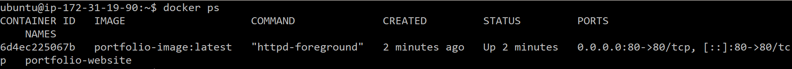

# LemiciIQ DevOps Exercise

## Part 1 : Version Control (Git & SSH):

## 1. Difference between git pull vs git fetch:

- git fetch: It downloads changes from remote repository but does not merge them automatically.  
- git pull: It downloads and merges changes from the remote repository into your branch.


## 2. Git Merge conflict example:
I created 2 branches(feature-A & feature-B) and made changes to the same file. When merging, git gave a following conflict:


```
Auto-merging code.txt
CONFLICT (add/add): Merge conflict in code.txt
Automatic merge failed; fix conflicts and then commit the result.

```


In order to perform this conflict I manually edited the file to keep both the changes:
"Hello from Feature-A and Feature-B"
and added the file to repository


## Part 2: Docker & Containerization: 

## 1. Difference between Dockerfile, Docker Image & Docker Container:

- Dockerfile: This file contains step by step instructions/commands to build our application.
- Docker Image: It is portable package that contains our application, created using dockerfile.
- Docker Container: It is a running instance of our application. Docker containers are lightweight, ephimeral and portable in nature.

## 2. How you would reduce the image size if your first build is too large:
1. We can use smaller and lighter base images like alpine, python-slim.
2. We can optimize layers in docker image by executing multiple commands in a single command.
3. We can avoid copying unnecessary files into docker by mentioning those file in .dockerignore file.

## 3. Application Container:

